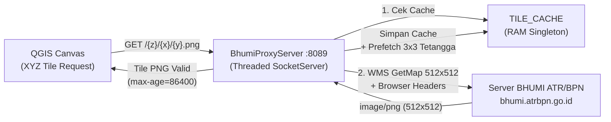

# 🗺️ BHUMI Persil Connector — QGIS Plugin

[](https://qgis.org/)
[](LICENSE)
[](https://github.com/rssyid/qgis-bhumi-persil/releases)

Plugin QGIS mandiri untuk memuat dan mengunduh bidang tanah resmi **BHUMI ATR/BPN** secara instan ke dalam kanvas peta QGIS melalui *local proxy tile server* berkecepatan tinggi dengan sistem **RAM Tile Cache** dan fitur **Export Area ke GeoTIFF Georeferenced Image**.

---

## ✨ Fitur Unggulan

1. **Integrasi Peta Bidang Tanah ATR/BPN Instan**
   - Menampilkan seluruh batas bidang tanah, batas persil, dan geometri ATR/BPN seluruh Indonesia secara lancar.
   - Mendukung rentang zoom luas mulai dari skala wilayah ($\le 1:15.000$) hingga skala sub-meter detail ($1:500$).

2. **Turbo Multi-Threaded Parallel Downloader (16 - 24 Threads)**
   - Proses unduh ubin (*tiles*) berlangsung serentak secara paralel dengan koneksi *connection pool* (64 jalur).
   - Dilengkapi dialog telemetri *live* yang menampilkan kecepatan unduh (tiles/detik) dan estimasi sisa waktu.

3. **RAM Tile Cache 24 Jam dengan Zoom-Out Persistence**
   - Setiap tile yang berhasil diunduh disimpan di memori RAM selama 24 jam.
   - Saat Anda melakukan *zoom out*, sistem secara otomatis menyusun mosaik dari tiles yang sudah ada di cache sehingga peta tetap tampil tanpa *blank*.
   - Dilengkapi tombol pembersih cache memory kapan saja.

4. **Export Area Terpilih ke GeoTIFF (Georeferenced Image)**
   - Seleksi area bebas dengan menarik kotak (*drag rectangle*) interaktif di kanvas.
   - Pilih target resolusi zoom (Zoom 14 s/d Zoom 19 / $\approx 0.3 \text{ m/px}$).
   - Opsi penggabungan garis persil dengan basemap kanvas aktif (Google Satellite / OSM).
   - Menghasilkan berkas **GeoTIFF (`.tif`)** berstandar GIS dengan proyeksi **EPSG:3857** lengkap dengan World File pendamping (`.tfw` & `.prj`).

5. **📐 Vektorisasi Poligon Otomatis (Simultan ke .SHP & .GeoJSON)**
   - Saat mengekspor GeoTIFF, sistem sekaligus dapat mengekstrak petak bidang tanah menjadi **Poligon Vektor Tertutup (*Polygon*)**.
   - Dilengkapi algoritma *anti-bergerigi* (*Douglas-Peucker simplification*).
   - Menghitung otomatis atribut **Luas Bidang ($m^2$)** dan **Keliling ($m$)**.
   - Menghasilkan dua berkas vektor sekaligus: **ESRI Shapefile (`.shp`)** dan **GeoJSON (`.geojson`)**, serta langsung memuat layernya ke kanvas QGIS!

---

## 🚀 Panduan Instalasi

### Cara 1 — Pasang dari Berkas ZIP (Sangat Mudah & Direkomendasikan)

1. Unduh berkas **`bhumi_persil.zip`** dari halaman [**Releases Terbaru**](https://github.com/rssyid/qgis-bhumi-persil/releases).
2. Buka software **QGIS**.
3. Di menu bar atas, klik **Plugins** $\rightarrow$ **Manage and Install Plugins...** (*Kelola dan Pasang Plugin*).
4. Di panel sebelah kiri, pilih tab **`Install from ZIP`** (*Pasang dari ZIP*).
5. Klik tombol **`...`** (Browse) lalu pilih berkas **`bhumi_persil.zip`** yang sudah diunduh.
6. Klik tombol **`Install Plugin`**.
7. Selesai! Toolbar **BHUMI ATR/BPN** langsung aktif di antarmuka QGIS Anda.

---

### Cara 2 — Console Script Installer (Untuk Developer)

Buka software QGIS, tekan `Ctrl + Alt + P` untuk membuka **Python Console**, lalu jalankan:

```python
import os, urllib.request; exec(open(r"D:\Web_app\qgis\bhumi_wms\install.py").read())
```

---

## 📖 Cara Penggunaan

### 1. Menampilkan Persil Bidang Tanah
- Klik tombol **`Tampilkan Persil (Bidang Tanah)`** di toolbar **BHUMI ATR/BPN**.
- Bidang tanah persil akan langsung dimuat di atas basemap Anda.

### 2. Mengunduh / Export Area ke GeoTIFF
- Klik tombol **`📷 Export Area ke GeoTIFF`** di toolbar.
- Kursor berubah menjadi `+`. Klik dan tarik kotak pada area peta yang diinginkan.
- Pada dialog yang muncul, pilih tingkat resolusi (*Zoom Level*) dan kecepatan download (*Thread*).
- Klik **`Export GeoTIFF...`** $\rightarrow$ tentukan lokasi berkas simpan. File GeoTIFF siap digunakan di QGIS, ArcGIS, maupun AutoCAD Map!

### 3. Mengelola Cache Memory
- Klik tombol **`🗑 Hapus Cache Tile`** untuk membersihkan memori RAM sewaktu-waktu.
- Arahkan kursor (*hover*) ke tombol untuk melihat statistik jumlah tiles dan MB memori yang digunakan.

---

## ⚙️ Arsitektur Teknis



---

## 📁 Struktur Berkas

```
qgis-bhumi-persil/
├── __init__.py          # Entry point classFactory QGIS
├── metadata.txt         # Metadata registrasi plugin QGIS
├── plugin.py            # Kelas utama plugin (toolbar, menu, lifecycle)
├── proxy_server.py      # Multi-threaded HTTP tile proxy (XYZ -> WMS BBOX 512x512)
├── tile_cache.py        # RAM tile cache (TTL 24h, zoom-out mosaic builder)
├── bhumi_layers.py      # Definisi layer aktif BHUMI ATR/BPN
├── settings_dialog.py   # Dialog konfigurasi port proxy
├── export_tool.py       # Turbo multi-threaded parallel tiles downloader & GeoTIFF exporter
├── package_plugin.py    # Skrip kemas berkas ZIP distribusi
├── install.py           # Skrip instalasi lokal via Python Console
├── resources/           # Ikon tombol toolbar
│   ├── icon.png
│   ├── bhumi_persil.png
│   ├── cache.png
│   ├── export.png
│   └── settings.png
└── README.md
```

---

## 📄 Lisensi

Proyek ini dirilis di bawah lisensi **MIT License**.
Dibuat untuk mempermudah kalangan profesional GIS, surveyor, dan perencana tata ruang dalam memanfaatkan data geospasial pertanahan di Indonesia.
